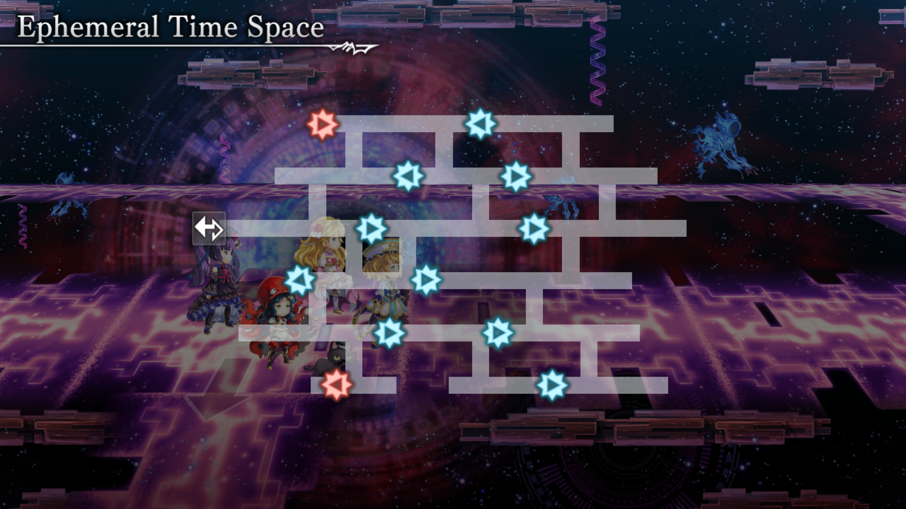
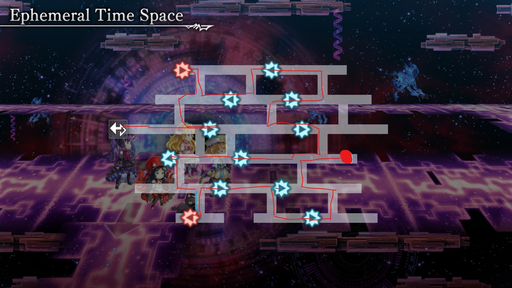
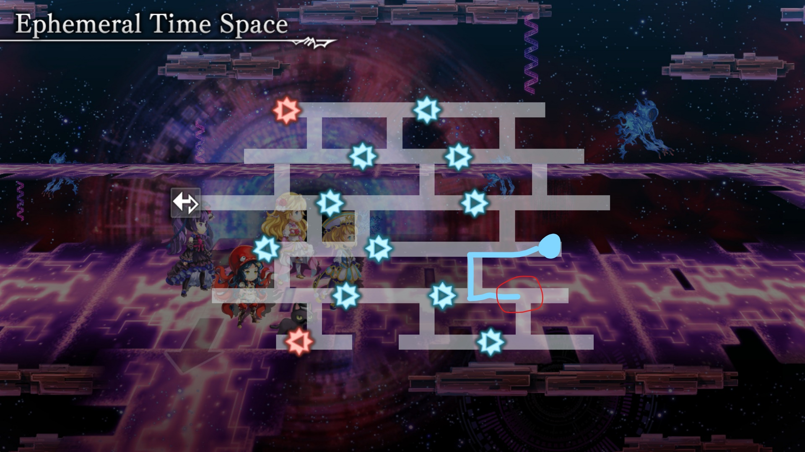

# Creating A Dungeon Macro - A guide by NoxNecro

## Introduction

Welcome to this guide on creating Another Dungeon macros!
In this guide I'll introduce you to the (very) basics of Auto Hotkey so you'll be able to make Dungeon Macros without having to wait on me ;)
Don't worry about not knowing enough about programming to understand this guide.
Simply being able to open a txt file and having some reading comprehension should be enough to understand the following information.
If you want to **understand** the code, and thus be better at creating and debugging it, feel free to read through the entire guide. 
If you just want to create macros without understanding what you're doing then you can skip to the TL;DR at the bottom. 
I'd personally recommend reading the whole thing through, as it will be a massive help while creating the macros.

## The Basics

When we create a Dungeon macro, we'll be working with something called "functions". Functions are magical things that you don't have to understand and just do magic :)
When I say that, I'm only messing around a tiny bit. While you do need to know a bit about them, I won't go into detail about functions unrelated to what we want to do.

### "Send"

If we want our computer to do something for us, we first have to tell it *what* to do. 
Using auto hotkey that is as simple as telling your computer ```send {f}```. If you run that code using Auto Hotkey, it will tell the computer to send the "f" key. Simple, right?
Well, not quite. You see, games usually require a key to be pressed for a little while. This is because when you press a key on your keyboard, it's totally possible for a different key to get activated for a few miliseconds. 
That'd be really annoying while gaming, no? 
What that means is that we have to press the key down for a bit, wait a while and get it back up.
That can be done through the following code:
```
send {a down} ; here we press the "a" key down
sleep 50 	  ; here we wait 50 miliseconds	
send {a up}	  ; and here we get the "a" key back up
```
So the "sleep" command basically tells the computer to wait a bit before doing the next task. After "sleep" you have to tell the computer how long it should wait.
This is always in miliseconds. If you ever get confused just do the amount of seconds you want it to wait and divide that by 1000!

The usefulness of ```sleep``` doesn't end there, however.
If you want to keep pressing a, you can just make the computer sleep longer.
so telling the computer to do the following:
```
send {a down}
sleep 10000
send (a up}
``` 
will make the computer keep pressing "a" for 10 seconds, which in a lot of games is walking to the left! Beginning to get the picture? ;)

### "Functions"

Next I'll explain functions.
This is a function:
```
function() 
{

}
```

but it doesn't do anything yet.
let's change that!

```
function() 
{
send {a down}
sleep 10000
send {a up}
}
```
Now whenever we say to the computer "do function", it will send the letter "a".
That's very usefull if we need to walk to the left (holding "a") a lot, because instead of saying "computer send {a down}, wait 50 miliseconds and send {a up}" we can just say "computer do the function"!

Now you might have noticed one or two issues already.
The first issue is that if we have multiple functions for multiple things, we can't call all of the "function" when telling the computer what to do.
Luckily we don't have to! Functions can be called anything you want.
For example:
```
WalkLeft() 
{
send {a down}
sleep 10000
send {a up}
}
```
This does the exact same as the code above, except the name is different.

### "Variables"

The second issue is that if you don't want to walk 10 seconds (10000 miliseconds) but 9, you have to make a whole new function.
And that's where Variables come in. No, no, don't leave I swear variables aren't hard!
A variable can basically be anything you want, as long as you tell it that it is that thing.
For example: 
```Variable = 100```
Now if we ask the computer what "variable" is, it will say "100".
And just like the functions, a variable can also be called whatever we want!

Now the next question is of course: "how do we use that in the macro?"
Well, we do the following:
```
WalkLeft()
{
send {a down}
sleep x ; (here the variable is called x)
send {a up}
}
```
now the program will sleep for 100 miliseconds, because the computer knows that "variable" = 100

But having to say what a variable is before the function everytime you want to use it is almost as bad as having to make a new function for every time, right?
That's why we can do something with the () after the function.
If we tell the computer "hey, when I tell you to do the function "Walkleft", then I want you to put the thing between brackets as the "variable".
We do that by putting "variable" in between those brackets like this: 
```
WalkLeft(x)
{
send {a down}
sleep x
send {a up}
}
```
And just like that we have massively shortened what would otherwise be an incredibly long program.
Because now everytime we want to walk left, we only have to say:
```WalkLeft(69)```
and your computer will know that it has to do the entire function called "WalkLeft" and that it has to sleep for 69 miliseconds!
Do keep in mind that every function you tell the computer to do has to be in your program. Just put it far away at the bottom of your script and it'll be fine though!

### Creating the macro + TL;DR

So now that we know how to use functions, the rest shouldn't be hard.
[Here]() is a template for a dungeon macro that has all the functions I use in it at the bottom.
Here is a list of them with explanations: 
WalkLeft(a) => Walks to the left for "a" amount of miliseconds
WalkRight(b) => Walks to the right for "b" amount of miliseconds
WalkRightUp(c) => Walks both to the right and up at the same time for "c" amount of miliseconds. 
WalkLeftUp(d) => Walks both to the left and up at the same time for "d" amount of miliseconds. 
WalkRightDown(e) => Walks both to the right and down at the same time for "e" amount of miliseconds. 
WalkLeftDown(f) => Walks both to the left and down at the same time for "f" amount of miliseconds. 
Battle(enemy) => Depending on the variable (this time not a number but a word; enemy = regular/horror/finalBoss) this function does certain actions to win a fight.

You might wonder why I have 4 functions that could technically be replaced by "WalkUp()" and "WalkDown()".
That's because timing is **very important** when making dungeon macros, as missing a single turn or enemy immediatly makes your macro useless.
These functions make it so that instead of going:
```
WalkLeft(1420)  ; Walks left for 1420 miliseconds
WalkUp(480)		; Walks up for 480 miliseconds
```
and having to constantly tweak the numbers until it works you can just do:
```
WalkRightUp(2000) ; Walks up and right at the same time for 480 miliseconds
```
which is a lot easier and requires way less tweaking.

## Example

When I made the macro for the "Transitory Time Space" dungeon (which is quite large) I first downloaded the map of the dungeon: 

And made a route I wanted to follow:

It's not very pretty but it certainly did the job. You just have to know your starting point and keep guessing walk times until you've finished the entire dungeon.

On this map you start at the big dot, so I knew I had to go to the left, down the first thing at the bottom, to the right down and to the left.
Only then would I get to my first enemy.
So I started by doing
```
WalkLeftDown(2000)
```
Which didn't get my quite far enough, so I changed 2000 to 5000.
Now 5000 was a bit too far, as I ran into an enemy I shouldn't fight yet.
So then I made it 3700, which worked perfectly.
Next up I'd have to go to the right and down.
Because there aren't any enemies to the right and down, you can overshoot by as much as you want.
So start with something like:
```
WalkRightDown(6000)
```
and slowly lower that number until you stop at the perfect place, which in this case would be right in front or after this area:


When you've finally reached an enemy, just run into them for as long as you want, as the battle will stop any movement anyways.
After running into them use battle(enemy/horror/finalBoss) depending on which enemy type it is.

And because movement gets stopped during a battle, this means that every battle is a good way to "reset" where you think you are.


So now just keep repeating that process until you've finished the entire dungeon!


## Conclusion

And that concludes this guide on creating Another Dungeon macros! 
I recommend checking out the .ahk file to understand, and if you understand what it does I'd say you're ready to make some macros yourself!
Another recommendation I can not stress enough is to get an actual good text editor (**NOT** the default "notepad").
If you're only planning on creating dungeon macros I'd recommend [Notepad++](https://notepad-plus-plus.org/downloads/) which is what I use to create my macros.


Goodluck with creating macros and don't forget to like and sub- ...wait a second this isn't youtube!


